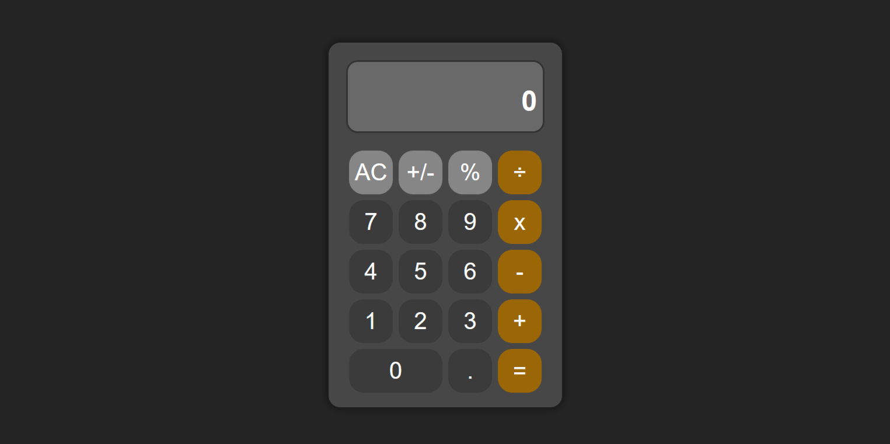

# ODIN-Calculator

Welcome to my Calculator App, a project from The Odin Project. This project is a simple yet powerful calculator designed to demonstrate the fundamentals of web development, including HTML, CSS, and JavaScript.

## Description

This Calculator App is a basic calculator with essential functionalities such as addition, subtraction, multiplication, and division. It features a clean and intuitive interface that makes it easy to perform calculations directly from your browser.

### Preview:

#### Technologies:
- JavaScript
- HTML
- CSS
